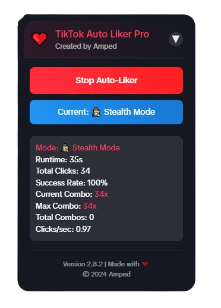

# TikTok Live Auto Liker Pro 🚀

A powerful and feature-rich userscript for automatically liking TikTok live streams with multiple modes, combo tracking, and a beautiful user interface.

## 🖼️ Preview

  

> Modern, draggable interface with real-time statistics, combo tracking, and multiple liking modes

## ✨ Features

- **Multiple Liking Modes**:
  - 🔄 Normal Mode: Balanced clicking (100-300ms)
  - 🚀 Turbo Mode: Fast clicking (30-100ms)
  - 🕵️ Stealth Mode: Natural-looking clicks (300-800ms)
  - ⚡ Combo Mode: Ultra-fast burst clicks (5-20ms)

- **Advanced Statistics**:
  - Real-time click tracking
  - Success rate monitoring
  - Clicks per second
  - Combo counter
  - Maximum combo tracking

- **Modern UI**:
  - Draggable interface
  - Collapsible panel
  - Beautiful animations
  - Position memory
  - Dark theme

- **Smart Features**:
  - Auto-detection of like button
  - Multiple detection methods
  - Error handling
  - Performance optimization
  - Session persistence

## 🚀 Installation

1. **Install Tampermonkey**:
   - [Chrome Extension](https://chrome.google.com/webstore/detail/tampermonkey/dhdgffkkebhmkfjojejmpbldmpobfkfo)
   - [Firefox Add-on](https://addons.mozilla.org/en-US/firefox/addon/tampermonkey/)
   - [Edge Extension](https://microsoftedge.microsoft.com/addons/detail/tampermonkey/iikmkjmpaadaobahmlepeloendndfphd)

2. **Install the Script**:
   - Click [here](https://github.com/AmpedWasTaken/TikTok-Live-Liker/raw/refs/heads/main/tiktok_live_autoliker.user.js) to install
   - Or copy the script content and create a new userscript in Tampermonkey

## 💡 Usage

1. **Open TikTok Live**:
   - Go to any TikTok live stream
   - The control panel will appear automatically in the center of the screen
   - Drag it to your preferred position (it will remember the position)

2. **Control Panel**:
   - Click "Start Auto-Liker" to begin
   - Use the mode button to switch between modes
   - Drag the panel by its header to reposition
   - Collapse/expand using the arrow button

3. **Keyboard Shortcuts**:
   - `L`: Toggle Auto-Liker on/off
   - `M`: Switch between modes

4. **Modes Explained**:
   - **Normal Mode**: Best for general use, balanced speed
   - **Turbo Mode**: Faster clicking for more likes
   - **Stealth Mode**: More natural behavior to avoid detection
   - **Combo Mode**: Maximum speed for achieving combos

## 📊 Statistics

The script provides real-time statistics:
- Total clicks performed
- Success rate percentage
- Current active combo
- Maximum combo achieved
- Clicks per second
- Runtime tracking
- Total combos completed

## ⚙️ Customization

The script automatically saves your preferences:
- Last used mode
- Panel position on screen
- Panel collapse state
- Statistics tracking

## 🔒 Safety Features

- Smart rate limiting to prevent detection
- Natural click patterns in Stealth Mode
- Error handling and recovery
- Multiple button detection methods
- Safe mode options

## ⚠️ Important Notes

1. **Performance**:
   - Different modes have different CPU usage
   - Combo Mode is the most intensive
   - Adjust based on your device's capabilities

2. **Browser Support**:
   - Works best on Chrome/Edge
   - Firefox may have slightly different performance
   - Mobile browsers not supported

3. **Limitations**:
   - Works only on TikTok live streams
   - Requires Tampermonkey
   - Performance may vary by device/browser
   - Follow TikTok's terms of service

## 🚫 Disclaimer

This script is for educational purposes only. Use responsibly and in accordance with TikTok's terms of service. The developers are not responsible for any misuse or consequences.

## 🤝 Contributing

Feel free to:
- Report bugs
- Suggest features
- Submit pull requests
- Share improvements

## 📜 License

MIT License - feel free to modify and share!

## 🙏 Credits

Created by Amped  
Version 2.8.2  
© 2024 All rights reserved 